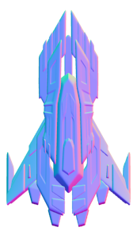

# Space Courier (Космический Путешественник)



## Содержание

1. [Обзор](#обзор)
2. [Игровая механика](#игровая-механика)
3. [Системы игры](#системы-игры)
   - [Система сложности](#система-сложности)
   - [Система достижений](#система-достижений)
   - [Система управления звуком](#система-управления-звуком)
   - [Система топлива](#система-топлива)
   - [Система жизней](#система-жизней)
   - [Система боссов](#система-боссов)
   - [Звездное поле (StarField)](#звездное-поле-starfield)
4. [Бонусы и усиления](#бонусы-и-усиления)
5. [Враги и препятствия](#враги-и-препятствия)
6. [Управление](#управление)
7. [Достижения](#достижения)
8. [Интерфейс](#интерфейс)
9. [Технические детали](#технические-детали)
10. [Сборка и запуск](#сборка-и-запуск)
11. [Разработчики и лицензия](#разработчики-и-лицензия)

## Обзор

Space Courier (Космический Путешественник) — динамичная 2D аркадная игра, в которой вы управляете космическим кораблем, выполняющим доставку грузов через опасные регионы космоса. Ваша задача — маневрировать между астероидами, уклоняться от вражеских кораблей, сражаться с боссами и собирать топливо для продолжения полета.

## Игровая механика

### Основные принципы

- **Бесконечный скроллер**: Геймплей основан на бесконечном движении космического пространства сверху вниз
- **Уклонение и сбор**: Основная задача - уклоняться от препятствий и собирать ресурсы
- **Прогрессивная сложность**: С ростом счета увеличивается сложность игры
- **Управление ресурсами**: Необходимо следить за уровнем топлива и количеством жизней
- **Битвы с боссами**: На каждом 5-м уровне появляется босс, которого нужно победить

### Цель игры

Основная цель - набрать как можно больше очков, уклоняясь от препятствий и собирая ресурсы. Очки начисляются за:
- Уклонение от астероидов (15 очков)
- Уклонение от вражеских кораблей (25 очков)
- Сбор канистр с топливом (20 очков)
- Победу над боссами (2000 очков)

### Игровые механики и правила

1. **Движение**: Корабль перемещается по всей игровой области, не ограничен одной линией
2. **Столкновения**: При столкновении с астероидами или вражескими кораблями игрок теряет жизнь
3. **Топливо**: Постоянно расходуется, при достижении нуля игрок теряет жизнь
4. **Система уровней**: С каждым новым уровнем повышается сложность игры
5. **Система жизней**: Максимальное количество жизней - 3, при потере жизни появляется возможность собрать новое сердечко

## Системы игры

### Система сложности

Игра использует продвинутую систему адаптивной сложности `DifficultySystem`, которая подстраивается под уровень мастерства игрока:

- **Базовая сложность**: Начинается с уровня 1.0 и растет по мере прогресса
- **Адаптация к игроку**: Система анализирует успехи и неудачи игрока, регулируя сложность
  - При успешном уклонении сложность постепенно повышается
  - При частых столкновениях сложность временно снижается
- **Зоны комфорта**: Система предотвращает слишком резкие скачки сложности
- **Уровни**: Всего реализовано 18 уровней сложности со следующими порогами очков:
  - Уровень 1: 0 очков
  - Уровень 2: 500 очков
  - Уровень 3: 1200 очков
  - Уровень 4: 2000 очков
  - Уровень 5: 3000 очков (Первый босс)
  - Уровень 6: 5000 очков
  - И так далее до уровня 18: 300000 очков

При повышении уровня сложности:
- Увеличивается скорость падения астероидов и врагов
- Увеличивается количество объектов на экране
- На уровнях, кратных 5, появляются боссы

### Система достижений

Игра содержит систему достижений `AchievementSystem`, отслеживающую прогресс игрока и предоставляющую награды за выполнение определенных условий:

#### Основные достижения:
1. **Первый полет** - Начать первое космическое путешествие
2. **Опытный курьер** - Достичь 5 уровня
3. **Мастер доставки** - Достичь 10 уровня
4. **Звездный рейтинг** - Набрать 10000 очков за одну игру
5. **Неуязвимый** - Набрать 3000 очков без потери жизней
6. **Заправщик** - Собрать 50 канистр с топливом
7. **Долгий путь** - Выжить в космосе в течение 5 минут

#### Дополнительные достижения:
1. **Элитный курьер** - Достичь 15 уровня
2. **Легендарный курьер** - Достичь 20 уровня
3. **Галактический рейтинг** - Набрать 25000 очков за одну игру
4. **Коллекционер топлива** - Собрать 100 канистр с топливом
5. **Космический марафонец** - Выжить в космосе в течение 10 минут
6. **Опытный пилот** - Совершить 10 космических полетов
7. **Корпоративная звезда** - Набрать 50000 очков за все время игры

Достижения сохраняются между игровыми сессиями и отображаются уведомлениями при их получении.

### Система управления звуком

Игра использует `SoundManager` для управления звуками и музыкой:

- **Настройки музыки**:
  - Возможность включения/выключения музыки
  - Регулировка громкости музыки (от 0% до 100%)
  - Автоматическое приостановление/возобновление при паузе/продолжении игры
  
- **Настройки звуковых эффектов**:
  - Возможность включения/выключения звуковых эффектов
  - Регулировка громкости эффектов (от 0% до 100%)
  - Настройка параметров отдельных звуков (громкость, высота тона, стерео-баланс)

Настройки звука доступны в меню паузы и сохраняются между игровыми сессиями.

### Система топлива

Топливная система - один из ключевых механизмов игры:

- **Максимальный запас**: 100 единиц топлива
- **Расход**: 2.4 единицы в секунду при движении
- **Пополнение**: +25 единиц за каждую собранную канистру с топливом
- **Предупреждение**: При остатке менее 20% появляется мигающее предупреждение
- **Штраф**: При полном израсходовании топлива игрок теряет жизнь, но получает 50% запаса

Топливо отображается в интерфейсе в процентах и с цветовой индикацией:
- **Зеленый**: Более 60% топлива
- **Желтый**: От 30% до 60% топлива
- **Красный**: Менее 30% топлива

### Система жизней

Система жизней определяет выживаемость игрока:

- **Максимальное количество**: 3 жизни
- **Потеря жизни**: Происходит при столкновении с препятствиями или полном расходе топлива
- **Восстановление**: Сердечки для восстановления жизней появляются только после потери жизни
- **Конец игры**: Наступает при потере всех жизней

Текущее количество жизней отображается сердечками в левом нижнем углу экрана.

### Система боссов

На каждом 5-м уровне (5, 10, 15 и т.д.) игрок сталкивается с боссом:

- **Характеристики босса**:
  - Здоровье: 20 единиц
  - Размер: 160x160 пикселей
  - Скорость перемещения: 80 пикселей в секунду
  - Движение: Перемещается из стороны в сторону в верхней части экрана

- **Атаки босса**:
  - Сброс астероидов: Каждые 2 секунды
  - Стрельба снарядами: Каждые 1.5 секунды, снаряды направляются в сторону игрока

- **Механика боя**:
  - Игрок может стрелять по боссу (пробел или касание экрана)
  - Каждое попадание снаряда наносит 1 единицу урона
  - Босс имеет кратковременную неуязвимость (0.3 секунды) после получения урона
  - Столкновение с боссом приводит к потере жизни игроком

- **Награда за победу**:
  - 2000 очков
  - Канистры с топливом (3 штуки)
  - Сердечко (если у игрока не максимальное количество жизней)
  - Случайные бонусы (2 штуки)

### Звездное поле (StarField)

Фоновая система, создающая эффект космического пространства:

- **Обычные звезды**:
  - Разные размеры (от 1 до 3 пикселей)
  - Разные цвета (белые, голубоватые, желтоватые)
  - Разная яркость и скорость движения
  - Эффект мерцания

- **Падающие звезды**:
  - Появляются случайным образом
  - Имеют эффект следа
  - Размер 32×32 пикселя
  - Двигаются по диагональным траекториям

Звездное поле создает динамичный, живой фон, усиливающий ощущение движения в космосе.

## Бонусы и усиления

В игре реализована система бонусов (powerups), дающих временные преимущества:

### Типы бонусов:

1. **Щит (Shield)**:
   - **Эффект**: Защищает от столкновений с астероидами, врагами и снарядами боссов
   - **Визуальное отображение**: Синий полупрозрачный щит вокруг корабля
   - **Продолжительность**: 10 секунд
   - **При столкновении**: Вместо потери жизни игрок получает очки

2. **Магнит (Magnet)**:
   - **Эффект**: Притягивает канистры с топливом и сердечки к кораблю
   - **Радиус действия**: 150 пикселей
   - **Скорость притяжения**: 300 пикселей в секунду
   - **Продолжительность**: 10 секунд

3. **Двойные очки (Double Score)**:
   - **Эффект**: Удваивает все получаемые очки
   - **Продолжительность**: 10 секунд

### Механика бонусов:

- **Случайное появление**: Каждые 15 секунд с вероятностью от 20% до 50% (зависит от сложности)
- **Гарантированное появление**: При повышении уровня и после победы над боссом
- **Активация**: При сборе бонуса кораблем
- **Индикация окончания**: За 3 секунды до окончания действия бонус начинает мерцать
- **Отображение**: Активные бонусы показываются в виде иконок в левом нижнем углу экрана

## Враги и препятствия

### Астероиды:

- **Размер**: 96×96 пикселей
- **Появление**: В группах по 4 штуки с паузами между группами
- **Скорость**: Зависит от уровня сложности, увеличивается от 100 до 230 пикселей в секунду
- **Поведение**: Падают сверху вниз, на малой высоте ускоряются и могут дрейфовать в стороны
- **Очки**: 15 очков за пролетевший мимо астероид

### Вражеские корабли:

- **Размер**: 96×96 пикселей
- **Появление**: В группах по 2 штуки, начинают появляться после 300 очков
- **Скорость**: Зависит от уровня сложности, быстрее астероидов
- **Поведение**: Следуют за игроком по горизонтали, пытаясь столкнуться
- **Очки**: 25 очков за пролетевший мимо корабль

### Канистры с топливом:

- **Размер**: 48×48 пикселей
- **Появление**: Примерно каждые 11 секунд
- **Скорость**: 80 пикселей в секунду, медленнее астероидов
- **Очки**: 20 очков за сбор
- **Эффект**: +25 единиц топлива

### Сердечки (жизни):

- **Размер**: 48×48 пикселей
- **Появление**: Только после потери жизни, примерно каждые 5 секунд
- **Скорость**: 80 пикселей в секунду
- **Эффект**: +1 жизнь (до максимума в 3 жизни)

## Управление

### Сенсорное управление (мобильные устройства):

- **Движение**: Коснитесь экрана, чтобы направить корабль в желаемую позицию
- **Стрельба по боссу**: Коснитесь экрана в любом месте
- **Пауза**: Нажмите кнопку паузы в правом верхнем углу

### Клавиатура (ПК):

- **Движение**: Стрелки или WASD
- **Стрельба по боссу**: Пробел
- **Пауза**: Escape

### Геймпад (контроллер):

- **Движение**: Левый стик или D-Pad
- **Стрельба по боссу**: Кнопка A/X (Xbox/PlayStation)
- **Пауза**: Start

## Достижения

Всего в игре 14 достижений, которые подробно описаны в разделе [Система достижений](#система-достижений).

## Интерфейс

### Основной игровой экран:

- **Верхняя часть**:
  - Счет (Score)
  - Текущий уровень (Level)
  - Сложность (Difficulty)
  - Прогресс до следующего уровня в процентах
  - Здоровье босса (во время боя с боссом)

- **Нижняя левая часть**:
  - Индикатор топлива с процентами
  - Сердечки, показывающие оставшиеся жизни
  - Иконки активных бонусов

- **Нижняя правая часть**:
  - Кнопка паузы (на мобильных устройствах)

### Экран паузы:

- Заголовок "ПАУЗА"
- Кнопка "ПРОДОЛЖИТЬ"
- Настройки музыки (вкл/выкл, громкость)
- Настройки звуковых эффектов (вкл/выкл, громкость)
- Кнопка "ГЛАВНОЕ МЕНЮ"

### Экран окончания игры:

- Заголовок "GAME OVER"
- Итоговый счет
- Кнопка "RESTART"
- Кнопка "MAIN MENU"

### Уведомления и эффекты:

- Анимация повышения уровня
- Уведомления о разблокировке достижений
- Предупреждение о низком уровне топлива
- Мерцание бонусов перед окончанием их действия

## Технические детали

### Используемые технологии:

- **Фреймворк**: [LibGDX](https://libgdx.com/) - кросс-платформенный Java фреймворк для разработки игр
- **Платформы**: Android и Desktop (Windows, Linux, macOS)
- **Графика**: 2D спрайты, поддержка различных разрешений экрана
- **Звук**: Встроенная система звуков и музыки LibGDX
- **Шрифты**: FreeType для высококачественных шрифтов с поддержкой масштабирования
- **Сохранения**: Preferences API для хранения настроек и прогресса

### Архитектура игры:

- **Модель экранов**: Главное меню, игровой экран, экран окончания игры
- **Системы управления**: Отдельные системы для звука, достижений, сложности и др.
- **Рендеринг**: Пакетное отображение спрайтов для оптимизации производительности
- **Физика**: Собственная система обнаружения столкновений с "мягкими" хитбоксами
- **Управление ресурсами**: Асинхронная загрузка ресурсов, управление памятью

## Сборка и запуск

Проект использует Gradle для управления зависимостями и сборки.

### Desktop версия:

```bash
./gradlew desktop:run
```

### Android версия:

```bash
# Сборка APK
./gradlew android:assembleDebug

# Установка на подключенное устройство
./gradlew android:installDebug
```

### Системные требования:

- **Android**: Android 7.0 (API 24) или выше
- **Desktop**: Java 8 или выше, OpenGL 2.0+ совместимая видеокарта

## Разработчики и лицензия

Игра Space Courier разработана с использованием фреймворка LibGDX.

### Команда:

- Разработчик - [Ваше имя/никнейм]
- Графика - [Автор графики]
- Звуковые эффекты - [Автор звуков]
- Музыка - [Автор музыки]

### Лицензия:

Этот проект распространяется под лицензией MIT. Подробную информацию можно найти в файле LICENSE.

---

*Удачных полетов, Космический Путешественник!*
